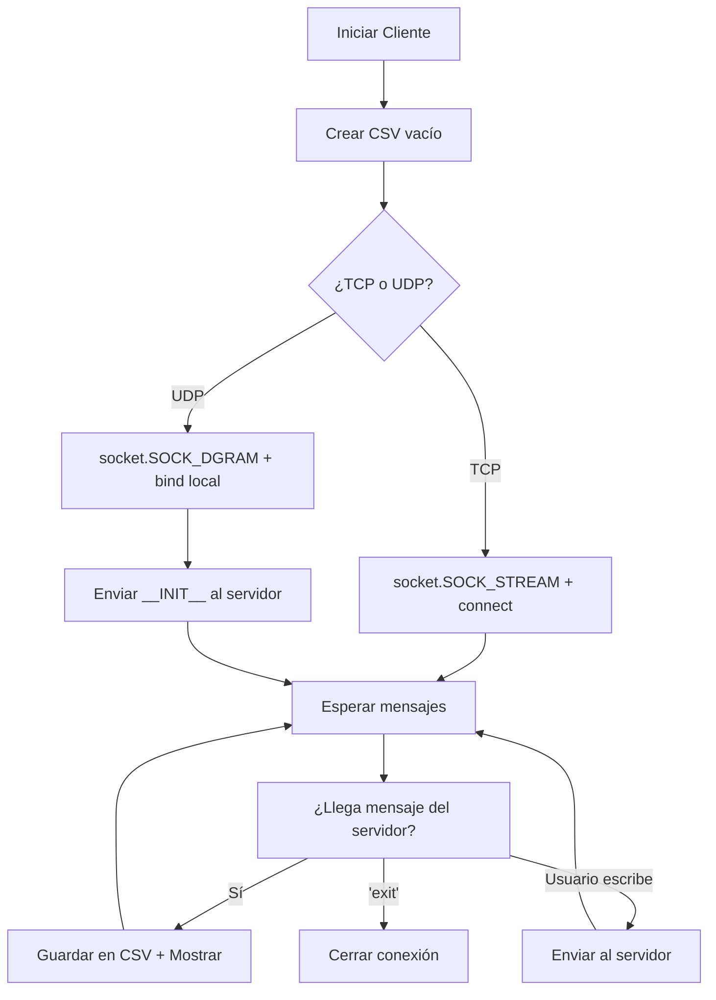
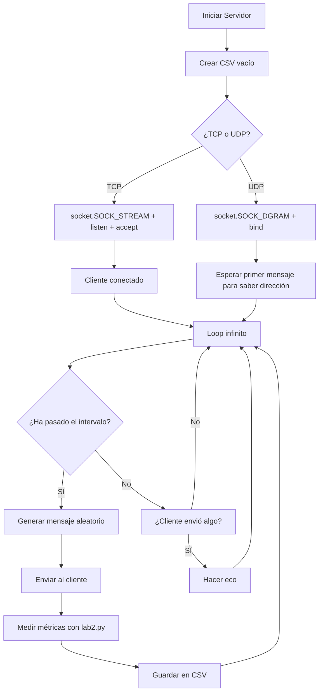
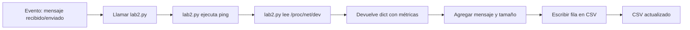
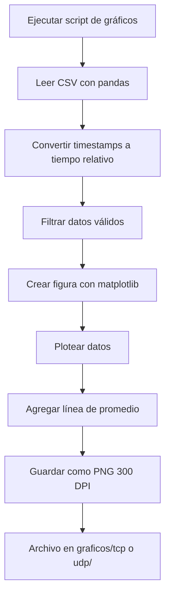
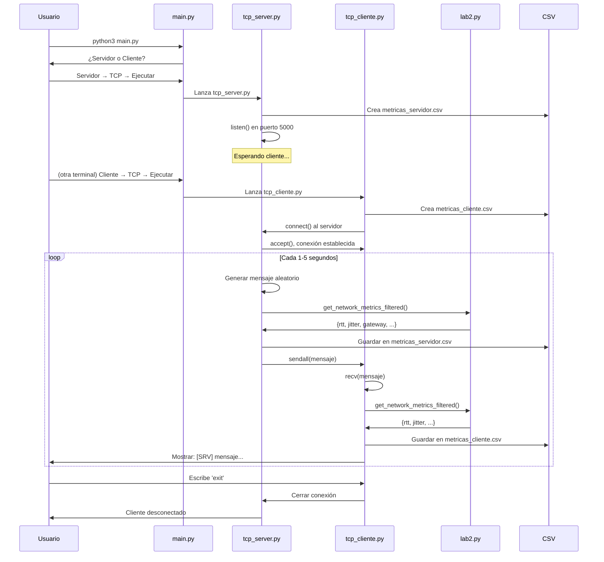
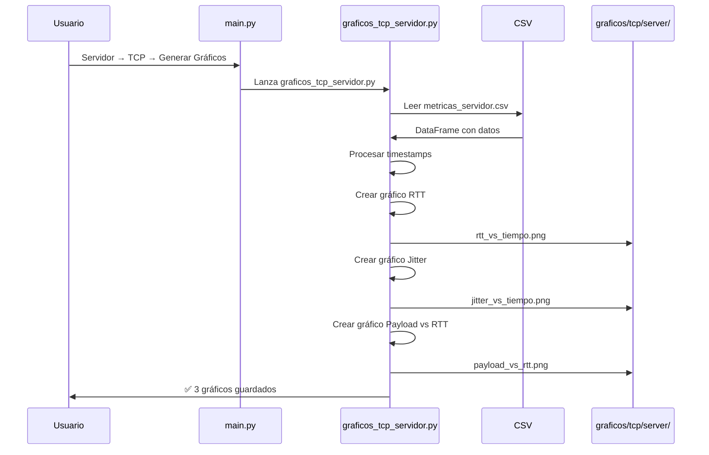

# 📚 Guía Interna Completa del Proyecto
## Laboratorio 2 - Redes de Computadores

> **Para el equipo**: Este documento explica TODO el proyecto en detalle.
> Perfecto para entender cómo funciona cada parte.

---

## 📋 Tabla de Contenidos

1. [¿Qué son TCP y UDP?](#qué-son-tcp-y-udp)
2. [Arquitectura del Proyecto](#arquitectura-del-proyecto)
3. [¿Cómo Funcionan los Clientes?](#cómo-funcionan-los-clientes)
4. [¿Cómo Funcionan los Servidores?](#cómo-funcionan-los-servidores)
5. [Las Diferencias Exactas: TCP vs UDP](#las-diferencias-exactas-tcp-vs-udp)
6. [¿Cómo se Generan los CSV?](#cómo-se-generan-los-csv)
7. [¿Cómo se Crean los Gráficos?](#cómo-se-crean-los-gráficos)
8. [Flujo Completo de Ejecución](#flujo-completo-de-ejecución)
9. [Preguntas Frecuentes](#preguntas-frecuentes)

---

## 🌐 ¿Qué son TCP y UDP?

### TCP (Transmission Control Protocol)

> **Analogía**: Es como enviar una carta certificada por correo.

#### Características:
- ✅ **Confiable**: Garantiza que el mensaje llegue completo
- ✅ **Ordenado**: Los mensajes llegan en el orden que fueron enviados
- ✅ **Con conexión**: Primero establece una "llamada" antes de enviar datos
- ⚠️ **Más lento**: Tiene overhead por todas las verificaciones

#### ¿Cuándo usar TCP?
- Cuando NO puedes perder datos (transferir archivos, mensajes importantes)
- Cuando el orden importa (conversaciones, streaming de video)
- Cuando prefieres seguridad sobre velocidad

---

### UDP (User Datagram Protocol)

> **Analogía**: Es como gritar en una habitación llena de gente.

#### Características:
- ⚡ **Rápido**: Sin overhead, envía directo
- ⚠️ **No confiable**: Los paquetes pueden perderse
- ⚠️ **Sin orden**: Pueden llegar desordenados
- ⚡ **Sin conexión**: Solo envía, no verifica

#### ¿Cuándo usar UDP?
- Cuando la velocidad es crítica (juegos online, videollamadas)
- Cuando perder un paquete ocasional no importa
- Cuando necesitas broadcast (enviar a muchos a la vez)

---

### 📊 Comparación Visual

| Característica | TCP 🔵 | UDP 🟢 |
|----------------|--------|--------|
| **Velocidad** | Moderada | ⚡ Rápida |
| **Confiabilidad** | ✅ 100% | ⚠️ Best-effort |
| **Conexión** | Sí (3-way handshake) | No |
| **Orden garantizado** | ✅ Sí | ❌ No |
| **Uso de CPU** | Mayor | Menor |
| **Tamaño overhead** | ~20-60 bytes | ~8 bytes |
| **Ejemplo de uso** | HTTP, FTP, Email | DNS, Zoom, Juegos |

---

## 🏗️ Arquitectura del Proyecto

### Estructura de Carpetas

```
raspberry-network-metrics/
│
├── codigos/                      # 🧠 El cerebro del proyecto
│   ├── tcp_cliente.py            # Cliente TCP
│   ├── tcp_server.py             # Servidor TCP
│   ├── udp_cliente.py            # Cliente UDP (casi igual al TCP)
│   ├── udp_server.py             # Servidor UDP (casi igual al TCP)
│   ├── graficos_tcp_cliente.py   # Hace gráficos de TCP cliente
│   ├── graficos_tcp_servidor.py  # Hace gráficos de TCP servidor
│   ├── graficos_udp_cliente.py   # Hace gráficos de UDP cliente
│   ├── graficos_udp_servidor.py  # Hace gráficos de UDP servidor
│   ├── lab2.py                   # 🔧 Librería que mide métricas
│   └── main.py                   # 🎮 Menú principal
│
├── registros/                    # 📊 Aquí se guardan los datos
│   ├── tcp/
│   │   ├── metricas_cliente.csv  # Datos del cliente TCP
│   │   └── metricas_servidor.csv # Datos del servidor TCP
│   └── udp/
│       ├── metricas_cliente.csv  # Datos del cliente UDP
│       └── metricas_servidor.csv # Datos del servidor UDP
│
└── graficos/                     # 📈 Aquí se guardan los gráficos
    ├── tcp/
    │   ├── cliente/              # PNG del cliente TCP
    │   └── server/               # PNG del servidor TCP
    └── udp/
        ├── cliente/              # PNG del cliente UDP
        └── server/               # PNG del servidor UDP
```

---

## 💻 ¿Cómo Funcionan los Clientes?

### Flujo de un Cliente (TCP o UDP)



### ¿Qué Hace el Cliente Paso a Paso?

#### 1️⃣ **Inicialización**

```python
# Crea el archivo CSV con las columnas
def inicializar_csv_cliente():
    writer.writerow([
        'fecha_hora',           # Timestamp de cuando llegó el mensaje
        'tam_mensaje_bytes',    # Cuántos bytes tiene el mensaje
        'protocolo',            # TCP o UDP
        'mensaje',              # ✨ El contenido del mensaje
        'rtt_promedio_ms',      # Latencia promedio
        'rtt_desv_std_ms',      # Qué tan variable es la latencia
        'jitter_ms',            # Variación entre paquetes
        'rx_mbps',              # Velocidad de descarga
        'tx_mbps',              # Velocidad de subida
        'gateway',              # IP del router
        'throughput_recepcion_mbps',  # Velocidad real de recepción
        'total_mensajes_recibidos',   # Contador
        'total_bytes_recibidos'       # Bytes acumulados
    ])
```

#### 2️⃣ **Crear el Socket**

**TCP:**
```python
# 🔵 TCP: Requiere conexión
sock = socket.socket(socket.AF_INET, socket.SOCK_STREAM)
sock.connect((HOST, PORT))  # "Llamar" al servidor
```

**UDP:**
```python
# 🟢 UDP: Sin conexión, solo bind local
sock = socket.socket(socket.AF_INET, socket.SOCK_DGRAM)
sock.bind(('', 0))  # Puerto aleatorio local

# 🔑 TRUCO IMPORTANTE: Enviar un mensaje inicial
# para que el servidor sepa nuestra dirección
sock.sendto("__INIT__\n".encode(), (HOST, PORT))
```

> **¿Por qué el `__INIT__` en UDP?**
> - En TCP, `connect()` ya le dice al servidor "hola, soy yo"
> - En UDP, el servidor no sabe tu dirección hasta que le envías algo
> - Sin `__INIT__`, servidor y cliente se quedarían esperando eternamente

#### 3️⃣ **Recibir Mensajes del Servidor**

**TCP:**
```python
data = sock.recv(1024)  # Recibe hasta 1024 bytes
mensaje = data.decode().strip()
```

**UDP:**
```python
data, addr = sock.recvfrom(1024)  # Recibe + dirección del remitente
mensaje = data.decode().strip()
```

#### 4️⃣ **Guardar en CSV**

```python
def guardar_metricas_cliente(tam_mensaje, mensaje, protocolo):
    # 1. Llamar a lab2.py para obtener métricas de red
    metricas = get_network_metrics_filtered()
    
    # 2. Calcular throughput acumulado
    throughput = calcular_throughput_recepcion()
    
    # 3. Escribir una fila en el CSV
    writer.writerow([
        datetime.now().isoformat(),  # Hora actual
        tam_mensaje,                  # Tamaño del mensaje recibido
        protocolo,                    # "TCP" o "UDP"
        mensaje,                      # ✨ Contenido del mensaje
        metricas['rtt_avg_ms'],      # Latencia (de lab2.py)
        metricas['rtt_std_ms'],      # Desviación estándar
        metricas['jitter_ms'],       # Jitter
        # ... y todas las demás columnas
    ])
```

#### 5️⃣ **Mostrar en Pantalla**

```python
print(f"[SRV] {mensaje}  "
      f"Tamaño: {tam_mensaje} bytes  "
      f"Mensajes: {received_messages}  "
      f"Throughput: {throughput:.4f} Mbps  "
      f"RTT: {metricas['rtt_avg_ms']}ms")
```

Salida típica:
```
[SRV] aB3xK9pL  Tamaño: 8 bytes  Mensajes: 5  Throughput: 0.0001 Mbps  RTT: 2.127ms
```

---

## 🖥️ ¿Cómo Funcionan los Servidores?

### Flujo de un Servidor (TCP o UDP)



### ¿Qué Hace el Servidor Paso a Paso?

#### 1️⃣ **Generar Mensajes Aleatorios**

```python
def random_payload():
    # Tamaño aleatorio entre 5 y 20 caracteres
    size = random.randint(5, 20)
    
    # Letras + números aleatorios
    # Ejemplo: "aB3xK9pL2" o "xY7kLm"
    return ''.join(random.choices(
        string.ascii_letters + string.digits, 
        k=size
    ))
```

#### 2️⃣ **Crear el Socket y Escuchar**

**TCP:**
```python
# 🔵 TCP: Requiere accept() para aceptar clientes
server = socket.socket(socket.AF_INET, socket.SOCK_STREAM)
server.bind((HOST, PORT))
server.listen(1)  # Esperar 1 cliente

conn, addr = server.accept()  # Bloquea hasta que alguien conecte
print(f"Cliente conectado: {addr}")
```

**UDP:**
```python
# 🟢 UDP: Solo bind, no hay accept
server = socket.socket(socket.AF_INET, socket.SOCK_DGRAM)
server.bind((HOST, PORT))
print(f"Servidor UDP escuchando en {HOST}:{PORT}")

# Variable para guardar la dirección del cliente
client_addr = None  # Se llenará cuando recibamos el primer mensaje
```

#### 3️⃣ **Enviar Mensajes Periódicamente**

```python
# Variables de tiempo
last_send = time.time()
next_interval = random.uniform(1, 5)  # Entre 1 y 5 segundos

while True:
    now = time.time()
    
    # ¿Ya pasó el tiempo?
    if now - last_send >= next_interval:
        payload = random_payload()  # Ej: "aB3xK9"
        
        # Enviar según protocolo
        if protocolo == "TCP":
            conn.sendall((payload + "\n").encode())
        else:  # UDP
            if client_addr:  # Solo si conocemos la dirección
                server.sendto((payload + "\n").encode(), client_addr)
        
        # Medir y guardar
        metricas = guardar_metricas_csv(len(payload), payload)
        
        # Siguiente intervalo aleatorio
        next_interval = random.uniform(1, 5)
        last_send = now
```

#### 4️⃣ **Hacer Eco de Mensajes del Cliente**

**TCP:**
```python
data = conn.recv(1024)
if data:
    conn.sendall(data)  # Devolver lo mismo
```

**UDP:**
```python
data, addr = server.recvfrom(1024)
if data:
    # Guardar la dirección del cliente (importante!)
    if client_addr is None:
        client_addr = addr
        print(f"Cliente conectado desde: {addr}")
    
    server.sendto(data, addr)  # Devolver lo mismo
```

---

## 🔄 Las Diferencias Exactas: TCP vs UDP

### 📝 Tabla de Diferencias en el Código

| Aspecto | TCP | UDP |
|---------|-----|-----|
| **Tipo de socket** | `SOCK_STREAM` | `SOCK_DGRAM` |
| **Cliente conecta** | `sock.connect()` | `sock.bind()` + envío inicial |
| **Servidor acepta** | `listen()` + `accept()` | Solo `bind()` |
| **Enviar datos** | `sendall(data)` | `sendto(data, addr)` |
| **Recibir datos** | `recv(1024)` | `recvfrom(1024)` → devuelve `(data, addr)` |
| **Conocer dirección** | Automático con `connect/accept` | Manual con primer `recvfrom` |
| **Puerto** | 5000 | 5001 |
| **Carpeta CSV** | `registros/tcp/` | `registros/udp/` |

---

### 🔍 Diferencias Línea por Línea

#### **Cliente: Creación del Socket**

```python
# ════════════════════════════════════════════════
# TCP
# ════════════════════════════════════════════════
sock = socket.socket(socket.AF_INET, socket.SOCK_STREAM)  # 🔵 STREAM
sock.connect((HOST, PORT))  # 🔵 Conecta al servidor

# ════════════════════════════════════════════════
# UDP
# ════════════════════════════════════════════════
sock = socket.socket(socket.AF_INET, socket.SOCK_DGRAM)   # 🟢 DGRAM
sock.bind(('', 0))  # 🟢 Bind a puerto local aleatorio

# 🟢 Envío inicial para "registrarse"
sock.sendto("__INIT__\n".encode(), (HOST, PORT))
```

---

#### **Cliente: Recibir Datos**

```python
# ════════════════════════════════════════════════
# TCP
# ════════════════════════════════════════════════
data = sock.recv(1024)  # 🔵 Solo recibe datos
mensaje = data.decode()

# ════════════════════════════════════════════════
# UDP
# ════════════════════════════════════════════════
data, addr = sock.recvfrom(1024)  # 🟢 Recibe datos + dirección
mensaje = data.decode()
```

---

#### **Cliente: Enviar Datos**

```python
# ════════════════════════════════════════════════
# TCP
# ════════════════════════════════════════════════
sock.sendall((msg + "\n").encode())  # 🔵 Envía al servidor conectado

# ════════════════════════════════════════════════
# UDP
# ════════════════════════════════════════════════
sock.sendto((msg + "\n").encode(), (HOST, PORT))  # 🟢 Envía a dirección específica
```

---

#### **Servidor: Inicialización**

```python
# ════════════════════════════════════════════════
# TCP
# ════════════════════════════════════════════════
server = socket.socket(socket.AF_INET, socket.SOCK_STREAM)  # 🔵 STREAM
server.bind((HOST, PORT))
server.listen(1)  # 🔵 Escuchar conexiones
conn, addr = server.accept()  # 🔵 Aceptar un cliente
print(f"Cliente conectado: {addr}")

# ════════════════════════════════════════════════
# UDP
# ════════════════════════════════════════════════
server = socket.socket(socket.AF_INET, socket.SOCK_DGRAM)  # 🟢 DGRAM
server.bind((HOST, PORT))
print(f"Servidor UDP escuchando")

client_addr = None  # 🟢 Se llenará al recibir primer mensaje
```

---

#### **Servidor: Enviar Datos**

```python
# ════════════════════════════════════════════════
# TCP
# ════════════════════════════════════════════════
conn.sendall((payload + "\n").encode())  # 🔵 Envía por la conexión

# ════════════════════════════════════════════════
# UDP
# ════════════════════════════════════════════════
if client_addr:  # 🟢 Solo si conocemos la dirección
    server.sendto((payload + "\n").encode(), client_addr)
```

---

#### **Servidor: Recibir Datos (Eco)**

```python
# ════════════════════════════════════════════════
# TCP
# ════════════════════════════════════════════════
data = conn.recv(1024)  # 🔵 Recibe de la conexión
if data:
    conn.sendall(data)  # 🔵 Hace eco

# ════════════════════════════════════════════════
# UDP
# ════════════════════════════════════════════════
data, addr = server.recvfrom(1024)  # 🟢 Recibe + dirección
if data:
    if client_addr is None:  # 🟢 Primera vez? Guardar dirección
        client_addr = addr
    server.sendto(data, addr)  # 🟢 Hace eco a esa dirección
```

---

### 📊 Resumen Visual de Cambios

```python
# SOLO ESTAS 4-5 LÍNEAS CAMBIAN ENTRE TCP Y UDP:

# 1. Tipo de socket
SOCK_STREAM  →  SOCK_DGRAM

# 2. Funciones de envío
sendall()    →  sendto(data, addr)

# 3. Funciones de recepción
recv()       →  recvfrom()  # devuelve (data, addr)

# 4. Cliente: conexión
connect()    →  bind() + envío inicial __INIT__

# 5. Servidor: aceptar
accept()     →  guardar addr del primer recvfrom()
```

**¡TODO LO DEMÁS ES IDÉNTICO!**
- Lógica de métricas: igual
- Escritura de CSV: igual
- Cálculo de throughput: igual
- Manejo de errores: igual
- Prints de consola: igual

---

## 📊 ¿Cómo se Generan los CSV?

### El Papel de `lab2.py`

`lab2.py` es la **librería mágica** que mide las métricas de red.

#### ¿Qué Hace `lab2.py`?

```python
def get_network_metrics_filtered():
    """
    Esta función mide métricas de red usando comandos del sistema
    """
    results = {}
    
    # 1. Obtener IP y Gateway
    ip, gateway = _get_ip_and_gateway("eth0")  # o "wlan0" para WiFi
    results["ip"] = ip
    results["gateway"] = gateway
    
    # 2. Medir RTT y Jitter con ping
    # Ejecuta: ping -c 10 [gateway]
    avg, std, jitter = _estimate_rtt_and_jitter(gateway, count=10)
    results["rtt_avg_ms"] = avg      # Latencia promedio
    results["rtt_std_ms"] = std      # Desviación estándar
    results["jitter_ms"] = jitter    # Variación entre paquetes
    
    # 3. Medir Throughput leyendo /proc/net/dev
    # Lee bytes enviados/recibidos en 1 segundo
    rx, tx = _estimate_iface_throughput("eth0", window_s=1.0)
    results["rx_mbps"] = rx  # Velocidad de descarga
    results["tx_mbps"] = tx  # Velocidad de subida
    
    return results
```

#### Comandos que Ejecuta Internamente

```bash
# Para IP y Gateway
ip -4 addr show dev eth0
ip route show default

# Para RTT y Jitter
ping -n -i 0.2 -c 10 192.168.100.1

# Para Throughput
cat /proc/net/dev
# (lee dos veces con 1 segundo de diferencia)
```

---

### Estructura del CSV

#### CSV del Cliente

```csv
fecha_hora,tam_mensaje_bytes,protocolo,mensaje,rtt_promedio_ms,rtt_desv_std_ms,jitter_ms,rx_mbps,tx_mbps,gateway,throughput_recepcion_mbps,total_mensajes_recibidos,total_bytes_recibidos
2025-11-07T22:47:53,14,TCP,aB3xK9pL2,2.127,0.119,0.147,N/A,N/A,192.168.100.1,0.0001,1,14
2025-11-07T22:47:56,8,TCP,xY7kLm,2.233,1.065,1.058,N/A,N/A,192.168.100.1,0.0002,2,22
```

**Explicación de cada columna:**

| Columna | ¿De dónde sale? | ¿Qué significa? |
|---------|-----------------|-----------------|
| `fecha_hora` | `datetime.now()` | Timestamp de cuando llegó |
| `tam_mensaje_bytes` | `len(data)` | Tamaño del mensaje recibido |
| `protocolo` | Parámetro `"TCP"` o `"UDP"` | Protocolo usado |
| `mensaje` | `data.decode()` | ✨ Contenido del mensaje |
| `rtt_promedio_ms` | `lab2.py` → `ping` | Latencia promedio |
| `rtt_desv_std_ms` | `lab2.py` → `ping` | Qué tan variable es la latencia |
| `jitter_ms` | `lab2.py` → `ping` | Variación entre paquetes |
| `rx_mbps` | `lab2.py` → `/proc/net/dev` | Velocidad de descarga |
| `tx_mbps` | `lab2.py` → `/proc/net/dev` | Velocidad de subida |
| `gateway` | `lab2.py` → `ip route` | IP del router |
| `throughput_recepcion_mbps` | Cálculo local | Velocidad real del cliente |
| `total_mensajes_recibidos` | Contador | Cuántos mensajes llevamos |
| `total_bytes_recibidos` | Suma acumulada | Bytes totales recibidos |

---

#### CSV del Servidor

```csv
fecha_hora,tam_payload_bytes,protocolo,mensaje,rtt_promedio_ms,rtt_desv_std_ms,jitter_ms,rx_mbps,tx_mbps,gateway
2025-11-07T22:47:56,7,TCP,aB3xK9p,2.071,0.242,0.407,N/A,N/A,192.168.100.1
```

**Explicación:**

| Columna | ¿De dónde sale? | ¿Qué significa? |
|---------|-----------------|-----------------|
| `fecha_hora` | `datetime.now()` | Timestamp de cuando envió |
| `tam_payload_bytes` | `len(payload)` | Tamaño del mensaje enviado |
| `protocolo` | Parámetro `"TCP"` o `"UDP"` | Protocolo usado |
| `mensaje` | `payload` | ✨ Contenido del mensaje enviado |
| `rtt_promedio_ms` | `lab2.py` → `ping` | Latencia promedio |
| (resto igual) | ... | ... |

---

### Flujo de Creación del CSV



---

## 📈 ¿Cómo se Crean los Gráficos?

### Scripts de Gráficos

Hay **4 scripts** que generan gráficos:
- `graficos_tcp_cliente.py`
- `graficos_tcp_servidor.py`
- `graficos_udp_cliente.py`
- `graficos_udp_servidor.py`

**Todos hacen lo mismo**, solo leen de carpetas diferentes.

---

### Proceso de Generación



---

### Código de un Gráfico

```python
import pandas as pd
import matplotlib.pyplot as plt

def generar_rtt_vs_tiempo(df):
    # 1. Preparar datos
    df['tiempo_segundos'] = (df['datetime'] - df['datetime'].min()).dt.total_seconds()
    
    # 2. Crear figura
    plt.figure(figsize=(12, 6))
    
    # 3. Plotear línea
    plt.plot(
        df['tiempo_segundos'],     # Eje X: tiempo
        df['rtt_promedio_ms'],     # Eje Y: RTT
        'b-o',                     # Azul con puntos
        markersize=4,
        linewidth=2,
        alpha=0.8,
        label='RTT'
    )
    
    # 4. Agregar línea de promedio
    promedio = df['rtt_promedio_ms'].mean()
    plt.axhline(
        y=promedio,
        color='r',
        linestyle='--',
        label=f'Promedio: {promedio:.2f} ms'
    )
    
    # 5. Etiquetas y título
    plt.title('RTT vs Tiempo - Servidor TCP', fontsize=14, fontweight='bold')
    plt.xlabel('Tiempo (segundos)', fontsize=12)
    plt.ylabel('RTT (ms)', fontsize=12)
    plt.grid(True, alpha=0.3)
    plt.legend()
    
    # 6. Guardar
    plt.savefig('graficos/tcp/server/rtt_vs_tiempo.png', dpi=300)
    plt.close()
```

---

### Gráficos Generados

#### **Para el Cliente**

1. **`rtt_vs_tiempo.png`**
   - Línea del RTT a lo largo del tiempo
   - Línea horizontal del promedio
   - Permite ver si la latencia es estable o variable

2. **`jitter_vs_tiempo.png`**
   - Línea del jitter a lo largo del tiempo
   - Muestra qué tan "nerviosa" está la red

3. **`throughput_vs_tiempo.png`**
   - Velocidad de recepción acumulada
   - Muestra cómo mejora con el tiempo

---

#### **Para el Servidor**

1. **`rtt_vs_tiempo.png`**
   - Igual que el del cliente

2. **`jitter_vs_tiempo.png`**
   - Igual que el del cliente

3. **`payload_vs_rtt.png`**
   - Scatter plot: tamaño vs RTT
   - Colormap por jitter
   - Muestra si mensajes grandes = más latencia
   - Incluye coeficiente de correlación

---

### ¿Qué Librerías Usan?

```python
import pandas as pd        # Para leer y manipular CSV
import matplotlib.pyplot as plt  # Para crear gráficos
```

**Pandas** (`pd.read_csv()`) lee el CSV y lo convierte en un DataFrame (tabla).

**Matplotlib** (`plt.plot()`) dibuja los gráficos y los guarda como PNG.

---

## 🔄 Flujo Completo de Ejecución

### Escenario: Ejecutar TCP



---

### Escenario: Generar Gráficos



---

## ❓ Preguntas Frecuentes

### 🤔 ¿Por qué hay 4 scripts de cliente/servidor?

Para mantener **separación clara** entre TCP y UDP. Así:
- No confundimos datos
- Podemos ejecutar ambos a la vez
- Es fácil comparar CSV y gráficos

---

### 🤔 ¿Por qué UDP necesita el mensaje `__INIT__`?

En UDP, el servidor no sabe la dirección del cliente hasta que recibe algo. Sin `__INIT__`:
- Cliente espera recibir
- Servidor espera conocer la dirección
- **Deadlock**: ambos esperan eternamente

Con `__INIT__`:
- Cliente envía inmediatamente al arrancar
- Servidor recibe y guarda `client_addr`
- Servidor empieza a enviar payloads

---

### 🤔 ¿Qué pasa si pierdo un paquete en UDP?

**No pasa nada grave**. El CSV simplemente no tendrá esa fila. UDP está diseñado para tolerar pérdidas.

En TCP, **nunca pierdes paquetes** porque hay retransmisión automática.

---

### 🤔 ¿Por qué `lab2.py` tarda en medir?

Porque ejecuta `ping -c 10`, que envía 10 paquetes con intervalo de 0.2s = **2 segundos**.

Además, lee `/proc/net/dev` dos veces con 1 segundo de diferencia = **1 segundo**.

Total: ~**3 segundos por medición**.

Esto es normal y necesario para obtener métricas precisas.

---

### 🤔 ¿Puedo cambiar el puerto?

Sí, solo edita:
```python
# En tcp_server.py y tcp_cliente.py
PORT = 5000  # Cambia a lo que quieras

# En udp_server.py y udp_cliente.py
PORT = 5001  # Cambia a lo que quieras
```

Asegúrate de que servidor y cliente usen el **mismo puerto**.

---

### 🤔 ¿Cómo conecto dos Raspberry Pi reales?

1. **En el servidor**: Deja `HOST = "0.0.0.0"`
2. **Averigua la IP del servidor**: `hostname -I`
3. **En el cliente**: Cambia `HOST = "127.0.0.1"` por la IP del servidor
4. Asegúrate de que **ambas Raspberry Pi estén en la misma red**

---

### 🤔 ¿Los gráficos se actualizan automáticamente?

**No**. Tienes que:
1. Cerrar el servidor/cliente (`Ctrl+C` o `exit`)
2. Ejecutar el script de gráficos
3. Los PNG se recrean con los datos nuevos

---

### 🤔 ¿Qué es el throughput?

Es la **velocidad real** a la que recibimos datos, medida en Mbps (megabits por segundo).

Fórmula:
```
throughput = (total_bytes_recibidos * 8) / tiempo_transcurrido / 1,000,000
```

Ejemplo:
- Recibiste 1000 bytes en 10 segundos
- `(1000 * 8) / 10 / 1e6 = 0.0008 Mbps`

---

### 🤔 ¿Qué es el jitter?

Es la **variación** en el tiempo entre paquetes.

- **Jitter bajo** (0.1 ms): Red estable, buena para videollamadas
- **Jitter alto** (10 ms): Red inestable, mala experiencia

Se calcula como el promedio de las diferencias absolutas entre RTTs consecutivos.

---

### 🤔 ¿Por qué algunos valores son `N/A` en el CSV?

Porque `lab2.py` no pudo medir esa métrica. Razones:
- No hay conexión a internet (no puede hacer ping al gateway)
- No tienes permisos para ejecutar `ping`
- La interfaz de red está caída

Esto es **normal** si estás probando en localhost.

---

## 🎓 Resumen para el Equipo

### Lo Más Importante

1. **TCP y UDP son casi idénticos en código**
   - Solo cambian 4-5 líneas
   - Lógica de métricas es la misma

2. **La columna `mensaje` guarda el contenido**
   - Permite trazabilidad completa
   - Facilita debugging

3. **`lab2.py` es la magia**
   - Mide RTT, jitter, throughput
   - Usa comandos del sistema

4. **Estructura organizada**
   - `registros/tcp/` vs `registros/udp/`
   - `graficos/tcp/` vs `graficos/udp/`
   - Imposible confundir

5. **El flujo es simple**
   - Servidor escucha → Cliente conecta
   - Servidor envía → Cliente recibe
   - Ambos guardan en CSV
   - Scripts de gráficos leen CSV

---

**Puntos clave a mencionar:**
- ✅ Implementamos TCP y UDP
- ✅ Solo 4-5 líneas de diferencia entre ambos
- ✅ Métricas completas: RTT, jitter, throughput
- ✅ Trazabilidad: columna `mensaje` en CSV
- ✅ Visualización: 3 gráficos por rol
- ✅ Organización clara: carpetas separadas

**Demo sugerida:**
1. Mostrar el menú `main.py`
2. Ejecutar servidor y cliente (TCP o UDP)
3. Mostrar CSV generado
4. Generar gráficos
5. Mostrar PNG

---

## 🎉 ¡Fin de la Guía!

Ahora el equipo completo entiende:
- ✅ Qué son TCP y UDP
- ✅ Cómo funcionan los clientes
- ✅ Cómo funcionan los servidores
- ✅ Las diferencias exactas entre TCP y UDP
- ✅ Cómo se generan los CSV
- ✅ Cómo se crean los gráficos
- ✅ El flujo completo de ejecución

---

*Última actualización: 2025-11-07*

